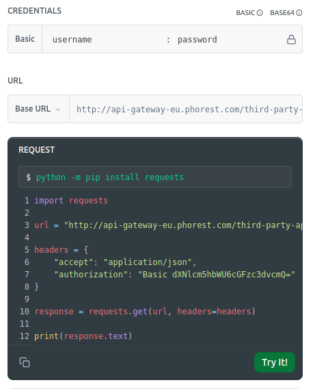

# Phorest Utils

[Phorest](https://www.phorest.com) is a Salon Software for Hair and Beauty Salons.

This python package [phorest_utils](https://github.com/TobiasBaer/phorest_utils) provides access to the
[Phorest REST API](https://developer.phorest.com/docs/getting-started) and enables various tasks, including:

 - **export_fritzbox_phonebook:** Exporting the clients to a Fritzbox phonebook XML file.

## Install

```bash
pip install git+https://github.com/TobiasBaer/phorest_utils.git
```

## Usage

Once installed, you can obtain the usage of this module via:

```bash
python -m phorest_utils --help
```

Help of submodules can be accessed with:

```bash
python -m phorest_utils <submodule> --help 
```
for instance:
```
python -m phorest_utils export_fritzbox_phonebook --help 
```

## Functionality 

### Create a Fritzbox Phonebook out of the clients

```
python -m phorest_utils export_fritzbox_phonebook
```

## Authentification

Accessing the Phorest REST API requires authentification. See
[Phorest API getting started](https://developer.phorest.com/docs/getting-started) for more details.

Phorest provides you an `business_id`, a `username` and a `password`. The `username` and the `password` are mangled into
an authentification token. You can obtain it via the
[Phorest API Reference](https://developer.phorest.com/reference/getreviewlist) website by filling out the `username`and
the `password`.



In this screenshot the `phorest_api_key` is generated as `dXNlcm5hbWU6cGFzc3dvcmQ=`

You can either pass the `buisiness_id` and the `phorest_api_key` via the command line options
`--phorest_api_key=PHOREST_API_KEY` or `--phorest_business_id=PHOREST_BUSINESS_ID` or export them via your environment
variables.
In case you want to use this repo with a devcontainer is vscode, you need to add a environment variables file like.

```bash
# .devcontainer/devcontainer.env
PHOREST_API_KEY=...
PHOREST_BUSINESS_ID=...
```

## Contribute

* Contribute via [pull request](https://github.com/TobiasBaer/phorest_utils/pulls)
* Or contact [Tobias.Baer@web.de](mailto:Tobias.Baer@web.de)

## Links

* https://github.com/TobiasBaer/phorest_utils
* https://developer.phorest.com/docs/getting-started
* https://www.phorest.com/
* https://jenia-baer.de
* https://paypal.me/DasPickAss
